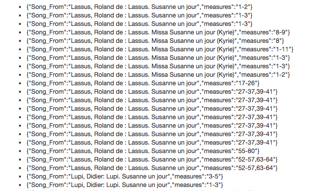

# CRIM Data Conversion Project :musical_score:

Convert and organize CRIM data set for furture analysis.

## Project Home Page

* [CRIM Homepage](https://sites.google.com/a/haverford.edu/crim-project/) - Check this out!

	to pull the data from the api and write it to CSVs run:

		`$ python3 counts.py`  

In the future a command line interface will be added and the functionally of the script will be expanded.

As of right now this script writes 7 csvs and one json file. Below is a brief description of each:

##### 1. ema.csv / 2. ema.json
As a csv this file has two features *SongTitle* and *Counts*. *SongTitle* is the title of the piece (e.g. Lassus Roland de : Lassus. Susanne un jour ) and *Counts* is a list of dictionary items. Each dictionary has the keys *measures* and *Song_From*. The *measures* information was pulled from the ema field of the json (which was pulled from the api). The *measures* value signifies which measures of the *SongTitle* were related to the *Song_From* in the users session. Below is an example of one row of the csv  

```
Lassus Roland de : Lassus. Susanne un jour, [ {'measures': '1-2', 'Song_From': 'Lassus, Roland de : Lassus. Susanne un jour'}, ... , {'measures': '31-35', 'Song_From': 'Lassus, Roland de : Lassus. Susanne un jour'} ]
```

The ema.json contains the exact same information but in a .json format

##### 3. relationship_types.csv  
This is just a count of the relationships of all of the sessions.   
This file looks like:
```
relationship_types,counts
rt-q,611
rt-tm,697
rt-tnm,1166
None,19
rt-om,108
rt-nm,354
```
##### 4. user_counts.csv
This is just a count of the sessions each user has created. In Omeka each user is assigned a unique id number which is listed as the *users* value.  
 This file looks like:
```
users,counts
1,3
6,19
5,8
15,583
13,2
...
```

##### 5. title_counts.csv
This is a count of for each piece , how many times it was referenced in a session.   
This file looks like:

```
titles,counts
Lassus Roland de : Lassus. Susanne un jour,57
Lassus Roland de : Lassus. Missa Susanne un jour (Kyrie),19
Forestier Mathurin: Forestier. Missa Baisés moy ma doulce amye (Kyrie),9
Lupi Didier: Lupi. Susanne un jour,11
Sermisy Claudin de: Sermisy. Tota pulchra es,147
Josquin Des Prés : Josquin. Baises moy,38
...
```
##### 6. assertion_types.csv
This is a count of the assertion types of all of the sessions.   
This file looks like:
```
assertion_types,counts
mt-sog,472
mt-pe,153
mt-cf,39
mt-fg,869
mt-id,221
...
```
##### 7. assertion_titles.csv
This is a count of the number of assertion made with each piece.   
This file looks like:
```
assertion_titles,counts
None,2
Forestier Mathurin: Forestier. Missa Baisés moy ma doulce amye (Kyrie),8
Lupi Didier: Lupi. Susanne un jour,4
Sermisy Claudin de: Sermisy. Tota pulchra es,16
Josquin Des Prés : Josquin. Baises moy,7
...
```

##### 8. assertion_scores.csv
This is a count of the number of assertion made for each unique score id.   
This file looks like:

```
assertion_scores,counts
c11,1782
c25,31
c13,4
c392,1
c406,1
c77,1
c140,1
...
```

## Visualizations
Currently we are working on two visualizations.
	One is a a modified chord diagram to visualize the relationship between musical types and relationship types. This was largely inspired by visualcinnamon's blog [post](https://www.visualcinnamon.com/2015/08/stretched-chord.html). This visualization is in the `matrix/` directory.

### Heat Map Visualization
Our other visualization is a heat map visualization that can be accessed in the file heatmap/index.html. 

###### Example output of search:



> This example output shows a list of the names of the different musical piece influences in the Lassus, Roland de : Lassus. Susanne un jour piece and the measure(s) where they can each be found.


#### Next steps
We are in the process of fine-tuning a parallel timelines layout (swimlanes) for representing state of time-series over time. This time-line would display the measures in a score along the x-axis and show how other attributes interact with that one score. The code for this is cloned from [vasturiano's repo](https://github.com/vasturiano/timelines-chart). We have the capability to search with different attributes for the the z-axis and y-axis and are now working on incorporating this functionality in the browser.

Richard has suggested that " we could have the 'groups' assigned to each Work_ID, then the 'labels' could be the individual Analyst_IDs (that is, the folks who made observations about each piece).  Colors could map to musical types or relationship types (two different views, I suppose).  Tooltip could reveal basic information about the item, plus a URL link to the music.  The timeline at the bottom could be from the start to the end of each piece".

##### searches available
song_b && song_a == song_from 

- query: user_id -  yaxis: song_b zaxis: song_a  ( note these could be flipped ) 
- query: title - yaxis: song_from zaxis: record_id 
the following two dont work bc the user.json doesnt have song_from attr 
- query: title - yaxis: song_from  zaxis: song_a
- query: title - yaxis: song_from  zaxis: song_b


### Droplet
We are in the process of starting a website to better collect all of our work on this Droplet: http://159.65.177.99/

## To do list
- [ ] Have a view with users, scores and (music|relationships) types as the color
- [ ] Have a view relationship types ( y-axis ), scores, music types as color
- [x] fix measures axis line up
- [x] view heatmap for one score at a time
- [ ] look into actual heatmap opacity functionality
- [ ] look into being able to toggle between different attributes for the axes
- [ ] make scripts to generate the jsons that the above visualizations will require
- [ ] optimize the table with possibly some linked data functionality


## Contributors :tada:

:octocat: [Maddy Hodges](https://github.com/Mfhodges) & [Tosin Alliyu](https://github.com/TA2018)  
With support by [Haverford College Digital Scholarship](https://github.com/hcdigitalscholarship)
